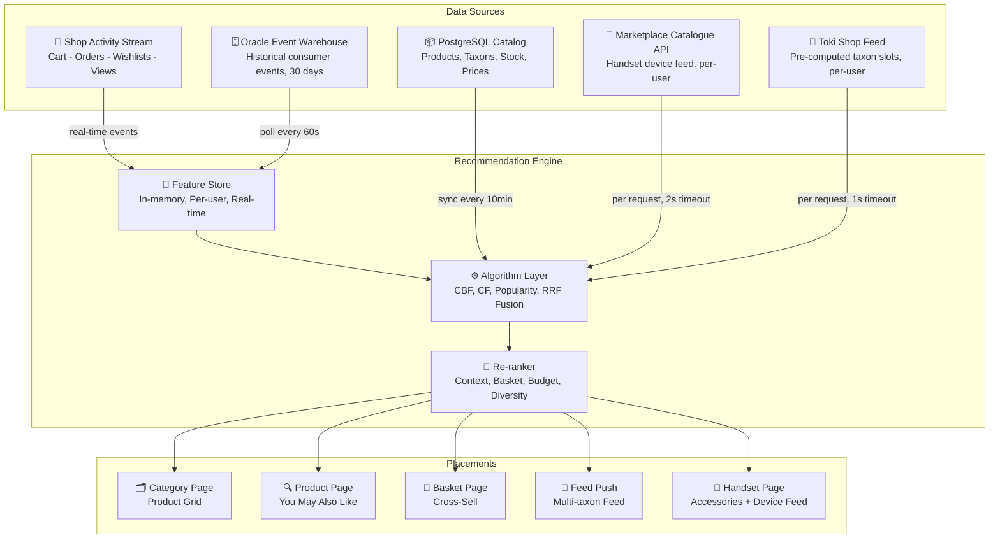
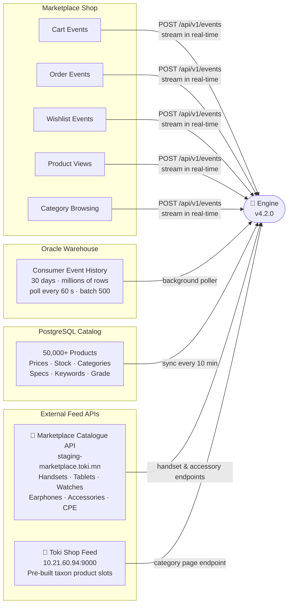
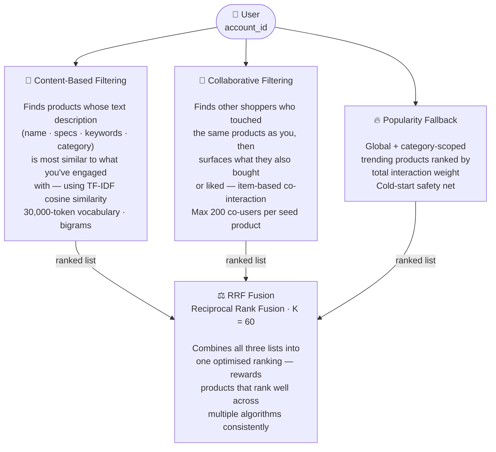
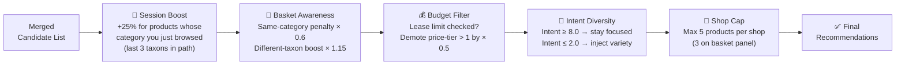
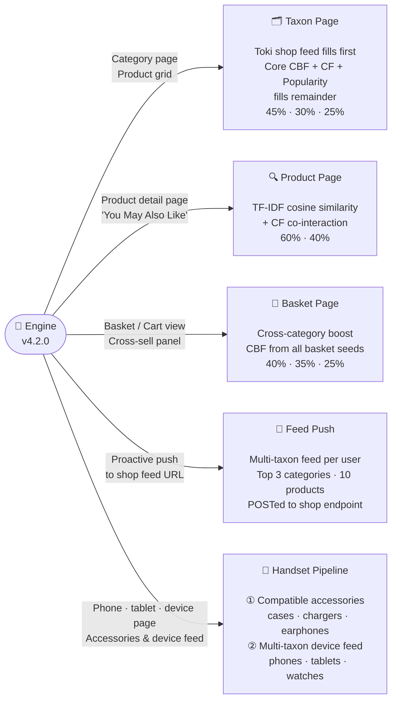
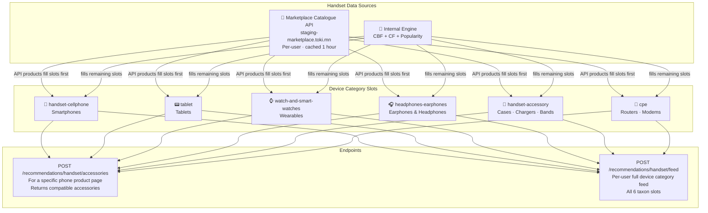
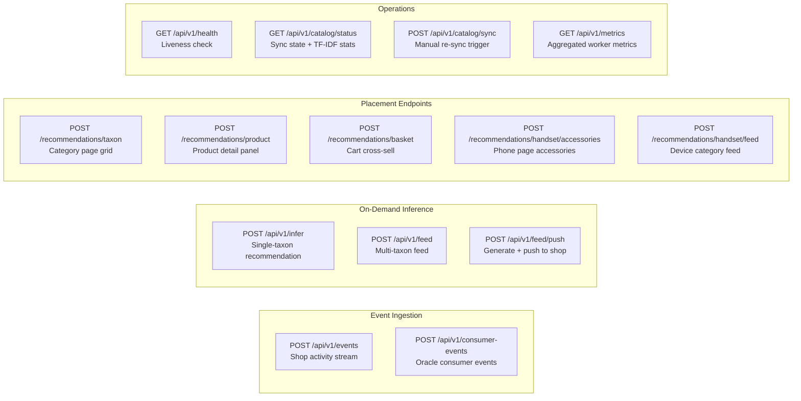
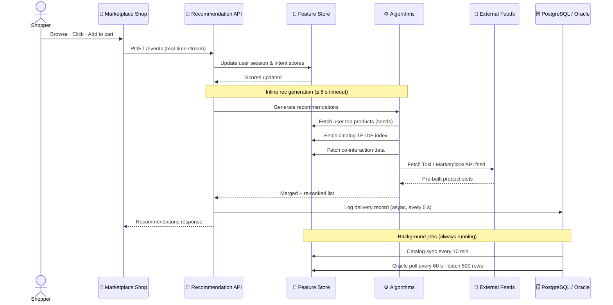
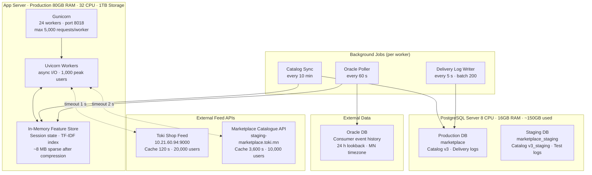
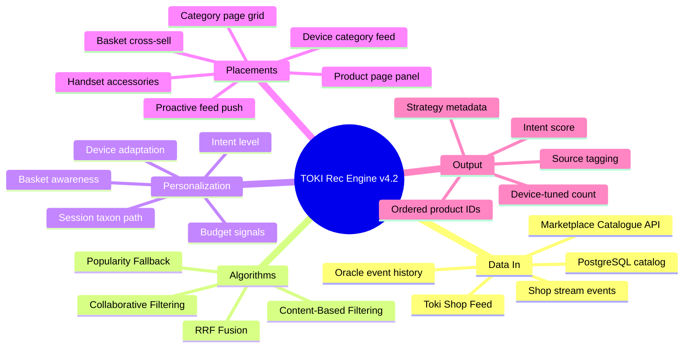

# TOKI Marketplace · Recommendation Engine
### A Living, Learning Intelligence — Built for Our Marketplace

---

> **Who is this for?**
> Product owners, business directors and managers, and marketplace teams who want to understand *what* this system does, *where* data comes from, and *how* it shapes every shopping experience — without needing to read code.

---

## 01 · What Does It Do?

The recommendation engine watches what every shopper does — what they browse, add to cart, order, and wishlist — and uses that signal to surface the right products to the right person at the right moment.

It runs **24 / 7**, learns **in real-time**, and personalises across **five distinct placements** inside the marketplace — including a dedicated handset & device pipeline.

---

## 02 · System at a Glance



---

## 03 · Where Data Comes From



### Signal Weighting — Not All Events Are Equal

| Signal | Weight | Meaning |
|--------|--------|---------|
| ✅ Order Completed | **5.0** | Strongest purchase intent |
| 📋 Lease Limit Checked | **4.0** | Serious buyer signal |
| 🛒 Add to Cart | **3.5** | High active interest |
| ❤️ Add to Wishlist | **3.0** | Notable interest |
| 👆 Product Click | **1.5** | Mild interest |
| 👁️ Product View | **1.0** | Passive browsing |
| 🗂️ Category Click | **0.5** | Exploration only |
| ❌ Cart Remove | **−1.5** | Negative signal |

> **Recency matters.** All signals decay with a **7-day half-life** — an order from yesterday matters far more than one from three weeks ago.

---

## 04 · How the Algorithms Work

Three independent retrieval engines run in **parallel**, then their ranked lists get fused.



### RRF Algorithm Weights Per Placement

| Placement | CBF | CF | Popularity |
|-----------|-----|----|------------|
| 🗂️ Category page | 45 % | 30 % | 25 % |
| 🔍 Product detail | 60 % | 40 % | — |
| 🧺 Basket cross-sell | 40 % | 35 % | 25 % |
| 📱 Handset accessories | 60 % | 40 % | fallback only |
| 📡 Handset device feed | 45 % | — | 55 % |

---

## 05 · Context Re-ranking — The Final Touch

After candidate generation and RRF merge, five re-ranking passes shape every final result:



---

## 06 · Five Placements, One Engine



---

## 07 · The Handset & Device Pipeline (New)

The handset pipeline connects to the **external Marketplace Catalogue API** and layers it with the internal recommendation engine — giving device pages a dedicated, deeply personalised experience.



**How accessory recommendations work for a phone page:**

1. Fetch this user's handset feed from the Marketplace Catalogue API (cached 1 h)
2. Pull accessory, earphone, and wearable slots → these products are shown first
3. Run TF-IDF CBF from the phone's content vector, **scoped to accessory taxons only**
4. Run CF co-purchase signals for that phone, scoped to accessories
5. RRF merge the internal results, apply re-rankers, fill remaining slots
6. Tag each result with source: `marketplace_api` / `internal` / `mixed`

---

## 08 · What the Responses Look Like

### Placement Response (category · product · basket · handset accessories)

```json
{
  "account_id":   "6800a429c127d95ecd882dd1",
  "placement":    "handset_accessories",
  "recommendations": [
    "68d3cd43d36b9be827b44e06",
    "68d3cd43d36b9be827b44e07",
    "68d3cd43d36b9be827b44e08"
  ],
  "strategy":          "marketplace_api+accessories_cbf+cf",
  "intent_score":      7.4,
  "device":            "mobile",
  "count":             10,
  "context_product_id": "68d3cd43d36b9be827b44e00",
  "served_at":         "2026-08-18T10:45:00Z"
}
```

### Handset Device Feed Response

```json
{
  "account_id": "6800a429c127d95ecd882dd1",
  "taxon_feeds": [
    { "taxon_slug": "handset-cellphone",  "count": 10, "source": "marketplace_api" },
    { "taxon_slug": "handset-accessory",  "count": 10, "source": "mixed"           },
    { "taxon_slug": "headphones-earphones","count": 8, "source": "internal"        }
  ],
  "total_products": 28,
  "strategy":       "marketplace_api+cbf+pop",
  "intent_score":   5.2,
  "device":         "miniprogram",
  "served_at":      "2026-08-18T10:45:00Z"
}
```

| Field | Meaning |
|-------|---------|
| `recommendations` | Ordered product IDs to display |
| `strategy` | Which pipelines contributed: `toki+cbf+cf+pop`, `marketplace_api+accessories_cbf+cf`, etc. |
| `intent_score` | User engagement level (sum of weighted events, 7-day decay) |
| `source` | Handset feed only: `marketplace_api` · `internal` · `mixed` |
| `device` | `mobile` · `desktop` · `miniprogram` · `unknown` |
| `count` | Product count — adapts per device type |

### Device-Aware Result Size

| Device | Products Returned |
|--------|------------------|
| 📱 Miniprogram | 8 |
| 📱 Mobile | 12 |
| 🖥️ Desktop | 20 |
| ❓ Unknown | 15 |

---

## 09 · All API Endpoints at a Glance



---

## 10 · Full Data Journey — End to End



---

## 11 · Infrastructure Snapshot



| Component | Detail |
|-----------|--------|
| **Production Server** | 80 GB RAM · 32 CPU cores · 1 TB storage |
| **API Stack** | FastAPI + Gunicorn, 24 async Uvicorn workers |
| **PostgreSQL Server** | 8 CPU · 16 GB RAM · ~150 GB currently in use |
| **PostgreSQL Environments** | Single server, two environments — production (`marketplace`) and staging (`marketplace_staging`) separated by database name and table suffix (`_staging`, `_archived_*`) |
| **In-Memory Store** | TF-IDF matrix + all user sessions + popularity — ~8 MB compressed sparse |
| **Catalog** | 50,000+ products · 30,000-token vocabulary · bigrams |
| **External APIs** | Toki shop feed (1 s timeout) + Marketplace catalogue API (2 s timeout) — both gracefully degraded |
| **Cold Start** | Popularity-based fallback; catalog quality score for brand-new products |
| **Monitoring** | `/api/v1/health` · `/api/v1/catalog/status` · `/api/v1/metrics` |

---

## 12 · Key Business Metrics Tracked

| Metric | What It Tells Us |
|--------|-----------------|
| `recs_served` | Total recommendations delivered across all placements |
| `by_strategy` | How often each algorithm mix wins (hybrid vs pure CBF vs popular) |
| `by_endpoint` | Which placements drive the most calls (taxon vs handset vs basket) |
| `by_device` | Where shoppers are: mobile, miniprogram, desktop |
| `events_processed` | Volume of real-time behavioural signal being consumed |
| `consumer_events_processed` | Oracle historical events ingested per poll cycle |
| `infer_timeouts` | System pressure indicator — recs dropped due to time budget |
| `by_activity` | Breakdown of signal types: orders, carts, wishlists, views |

> Metrics are aggregated every 10 seconds across all 24 workers and available via `GET /api/v1/metrics`.

---

## Summary



---

*TOKI Marketplace Recommendation Engine · v4.2.0 · Internal Presentation · 2026-08-18*
