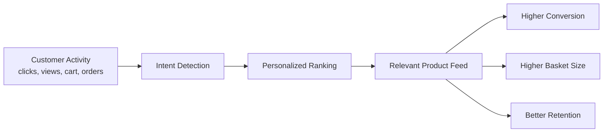
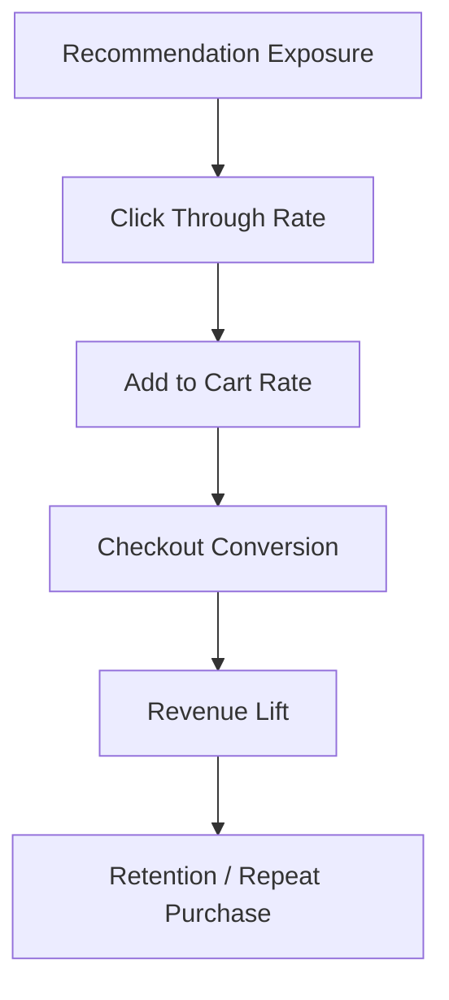
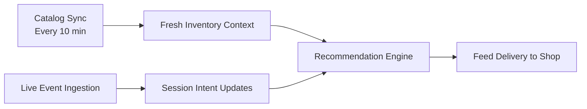
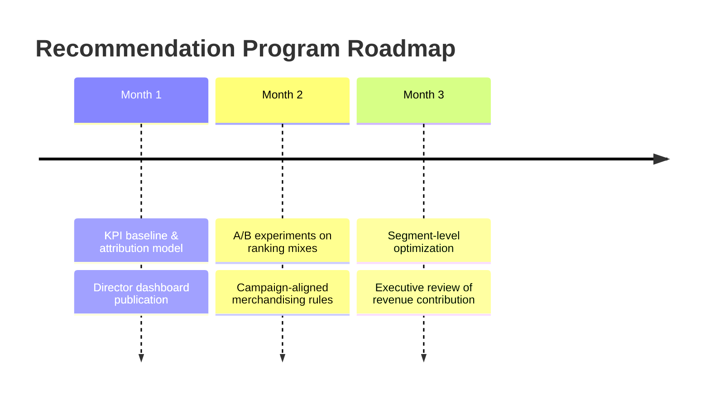

# Business Overview: TOKI Recommendation System

> Audience: Director / Business Leadership  
> Purpose: Explain how the recommendation engine drives revenue, conversion, and customer experience.

---

## 1) Executive Summary

The TOKI recommendation system turns real-time customer behavior into personalized product suggestions across marketplace taxons.  
From a business lens, this capability is a **growth and efficiency lever**:

- Increases conversion probability by surfacing intent-aligned items at the right moment.
- Improves average basket value through cross-sell and complementary discovery.
- Reduces missed revenue from cold-start users with popularity-based fallback.
- Supports scalable merchandising without requiring fully manual curation.

**Bottom line:** The engine operationalizes customer intent into automated merchandising decisions in seconds.

---

## 2) How Business Value Is Created

### Value drivers

- **Relevance at speed:** recommendations update from live events, reducing delay between intent and offer.
- **Hybrid precision:** combines behavior-based similarity with marketplace popularity, balancing personalization and reliability.
- **Commercial guardrails:** diversity caps and basket-aware logic avoid repetitive feeds and encourage broader sell-through.
- **Cold-start coverage:** even new users receive useful suggestions, improving first-session monetization.

---

## 3) Business Capabilities (What Leadership Gets)

| Capability | Business Benefit | Strategic Impact |
|---|---|---|
| Real-time intent scoring | Faster response to customer demand signals | Better conversion during active sessions |
| Hybrid recommendation strategy | More robust recommendation quality | Lower dependency on one algorithm |
| Multi-taxon feed generation | Cross-category visibility for products | Improved catalog monetization |
| Device-adaptive serving | Better UX by channel (mobile/desktop/miniprogram) | Higher engagement consistency |
| Basket-aware ranking | Smarter cross-sell opportunities | Increased average order value |
| Rule-based risk controls | Prevents poor recommendation patterns | Protects user trust and brand quality |

---

## 4) Commercial Impact Framework

Use this framework to track director-level outcomes each month/quarter:

### Suggested KPI stack

- **Top-line:** incremental GMV attributable to recommendations.
- **Funnel:** recommendation CTR, add-to-cart rate, conversion rate.
- **Value:** AOV uplift and items per order uplift.
- **Coverage:** % of active users receiving personalized vs fallback recommendations.
- **Quality:** diversity score (taxon/shop spread), duplicate suppression rate.
- **Reliability:** recommendation API uptime and latency at P95.

---

## 5) Operational Readiness for Scale

### Why this matters to operations

- Supports near real-time adaptation without manual intervention.
- Keeps recommendations aligned with current catalog state.
- Enables consistent decisioning across multiple user journeys and channels.

---

## 6) Risk & Governance View (Business-Safe AI)

| Risk Area | Current Mitigation | Leadership Visibility |
|---|---|---|
| Over-personalization / filter bubbles | Popularity blending + diversity cap | Balanced exposure performance |
| Low-quality repetitive suggestions | Basket-aware penalties + deduping | Feed quality trend monitoring |
| New-user relevance gap | Cold-start fallback logic | New-user conversion monitoring |
| Catalog drift | Scheduled sync process | Data freshness SLA tracking |
| Experience inconsistency by device | Device-specific top-N serving | Channel KPI comparison |

---

## 7) 90-Day Business Roadmap (Non-Technical)

### Priority outcomes

- Establish recommendation-attributed revenue reporting.
- Validate uplift through controlled experimentation.
- Move from general optimization to segment-specific growth strategies.

---

## 8) Director Talking Points (Use in Presentation)

1. **This is not just an algorithm — it is a revenue engine** that converts intent signals into automated merchandising actions.
2. **It improves both growth and efficiency** by increasing relevance while reducing manual curation dependency.
3. **It is scalable and operationally mature** with real-time behavior ingestion plus recurring catalog refresh.
4. **It is business-governed** through fallback logic, diversity controls, and measurable KPI ownership.
5. **Next phase is monetization proof at executive level** via attribution and A/B validated uplift.

---

## 9) One-Slide Summary

**Problem:** Generic product feeds miss intent and waste monetization opportunities.  
**Solution:** Real-time, hybrid recommendations that personalize by session behavior and catalog context.  
**Result:** Higher conversion, stronger basket value, and better customer retention with scalable operations.  
**Next ask:** Align on KPI targets and run a 90-day uplift validation program.

